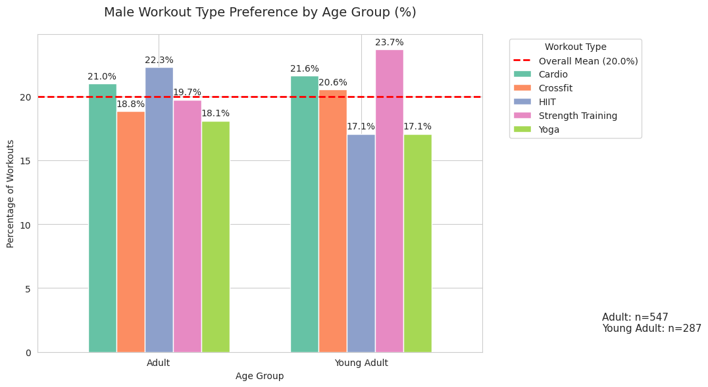
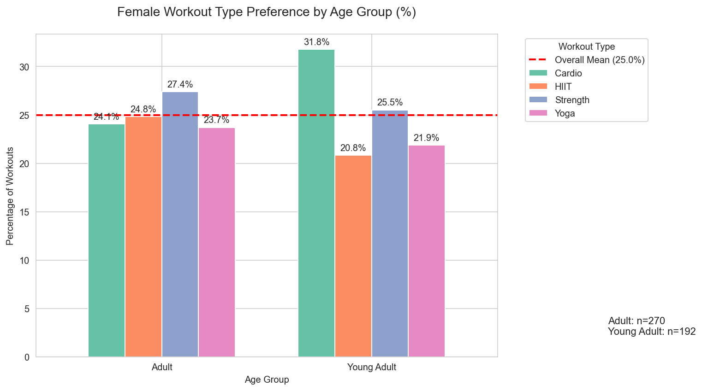
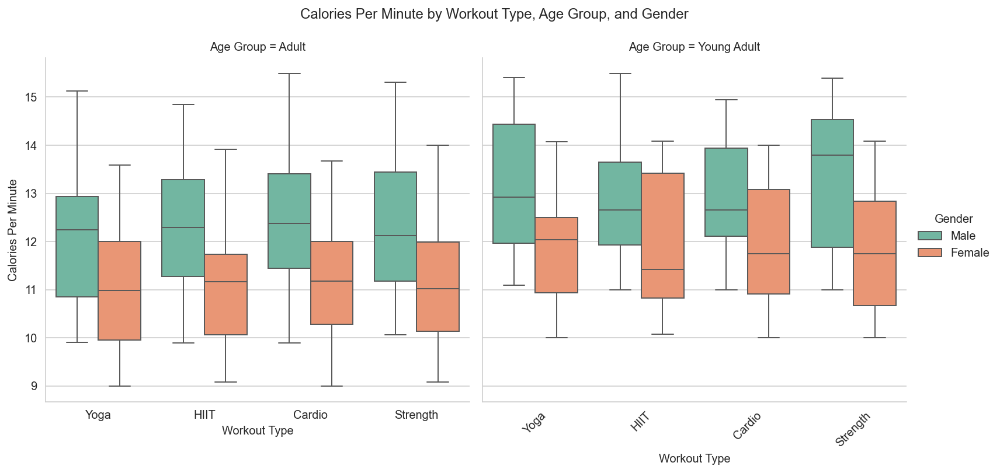

# Workout Data Analysis: Gender & Age Differences in Fitness Preferences & Calorie Burn

**Exploratory Data Analysis** of workout preferences and training intensity using a real-world dataset.

[](https://colab.research.google.com/github/d-toups/workout-data-analysis/blob/main/notebooks/workout_data_eda.ipynb)


## Project Objective

Analyze how **workout type preferences** and **training intensity** (Calories Per Minute) vary by gender and age group to derive actionable insights for fitness apps, gyms, and wellness platforms.

## Key Business Questions
- Do workout preferences differ by gender?
- How does training intensity vary across age groups?
- What patterns can inform personalized fitness recommendations?

## Key Results
- Both males and females show a general preference for **Strength Training** and **Cardio**.
- **Young Adult males** have the strongest preference for **Yoga** among all groups.
- Young Adults (18-34) train at **significantly higher intensity** than Adults (35-59) for both genders (p < 0.001).
- No statistically significant association between gender and workout type preference (Chi-square p-values: 0.5785 for Young Adults, 0.7021 for Adults).

## Tech Stack
- Python
- pandas
- seaborn + matplotlib
- scipy (statistical testing)

## Repository Structure
```bash
workout-data-analysis/
├── notebooks/
│   └── workout_data_eda.ipynb                 ← Main analysis notebook
├── src/
│   └── workout_data_analysis.py                    ← Clean Python functions
├── reports/
│   └── figures/                               ← Saved visualizations
├── data/
├── requirements.txt
├── README.md
└── LICENSE
```

## How to Reproduce

```bash
# Clone the repository
git clone https://github.com/d-toups/workout-data-analysis.git
cd workout-data-analysis

# Install dependencies
pip install -r requirements.txt

# Open the notebook
jupyter notebook notebooks/workout_data_eda.ipynb
```
Or simply click the "Open in Colab" badge above.

## Results Visualizations

**Male Workout Preferences**


**Female Workout Preferences**


**Calories Burned per Minute**


## Conclusions & Key Insights
- **Workout Preferences**: Both genders favor Strength Training and Cardio overall. Young Adult males stand out with a particularly strong preference for Yoga.
- **Training Intensity**: Age is a much stronger driver than gender — Young Adults train significantly harder than Adults (highly significant t-tests).
- Statistical tests confirm that while visual patterns exist, gender-based workout type differences are **not statistically significant**.
**Business Takeaway**: Prioritize age over gender when personalizing workout **intensity**. Gender can still guide soft recommendations for workout types.

## Limitations
- Moderate sample size (~973 records) limits statistical power for some tests.
- No data available for individuals aged 60+.
- While the dataset contains additional features (BMI, workout duration, frequency, etc.), this analysis focused only on gender, age group, and workout type.
- No multiple comparison correction was applied to the t-tests.

## Future Work
- Explore additional features in the dataset (BMI, frequency, goals, etc.).
- Include effect size metrics alongside p-values.
- Perform regression analysis to understand combined effects of multiple variables.
- Build predictive models for calorie burn or personalized recommendations.
- Create an interactive dashboard (Streamlit / Plotly) for user segmentation.
